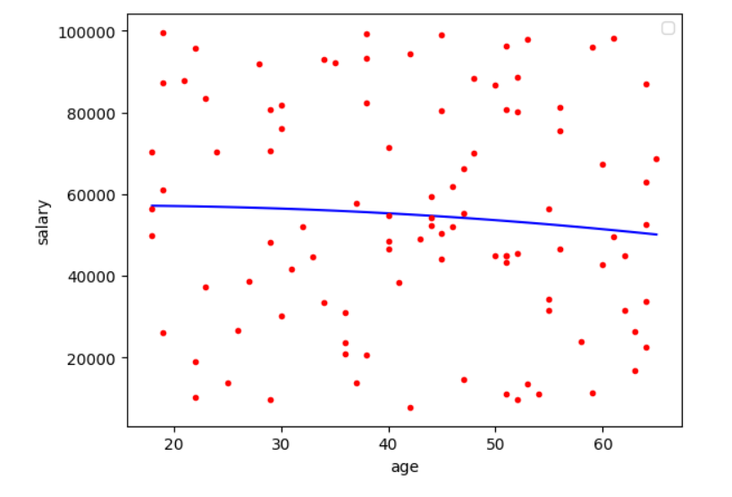
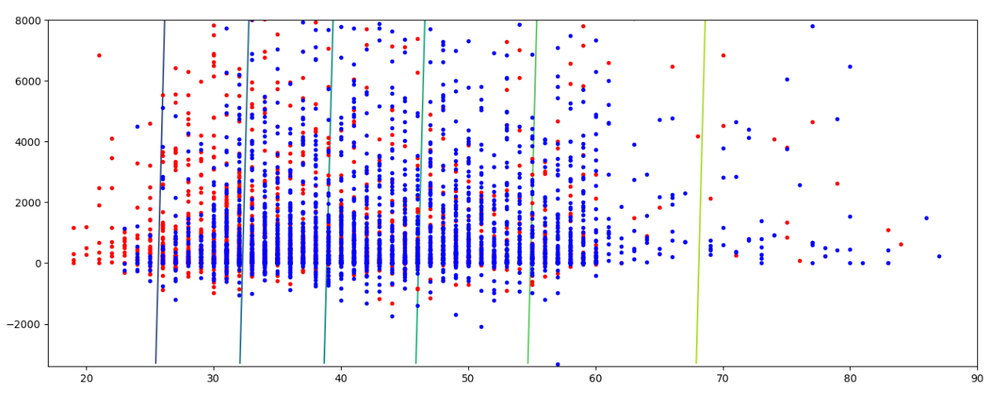
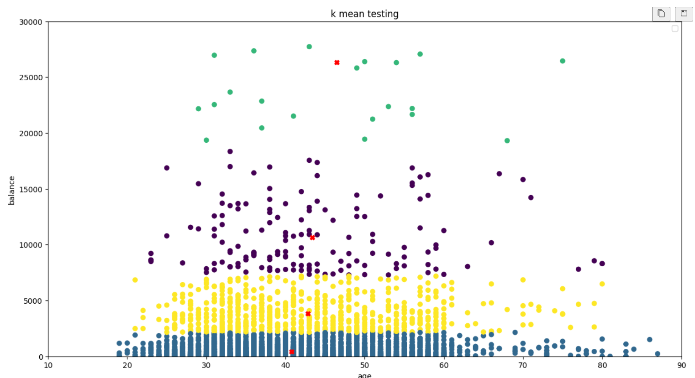
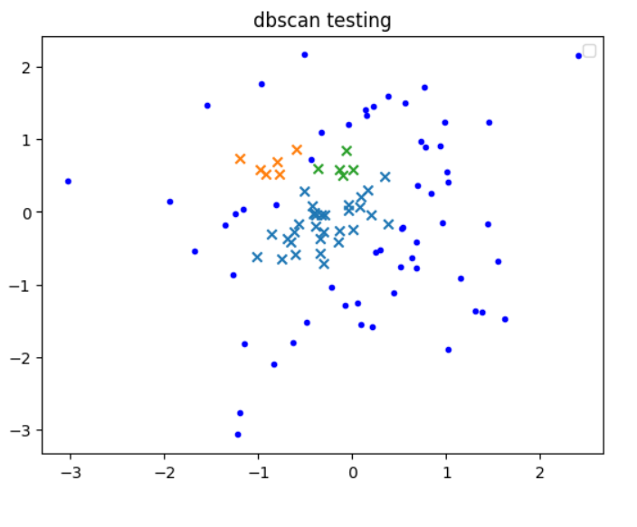
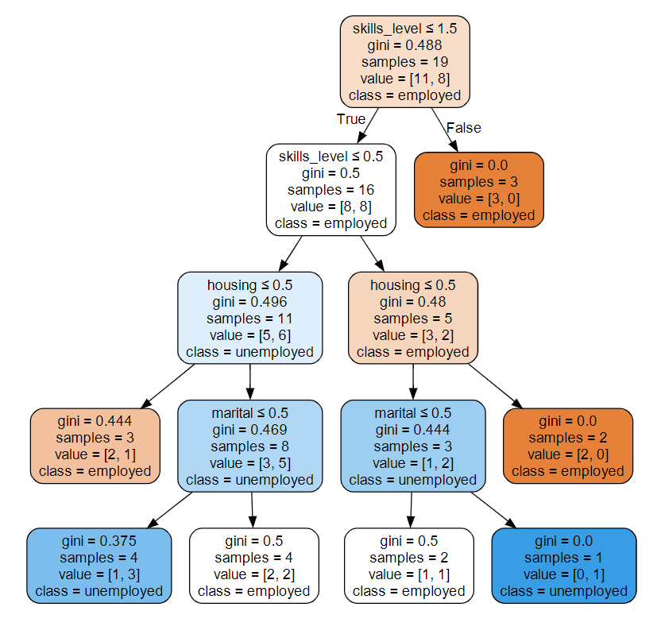
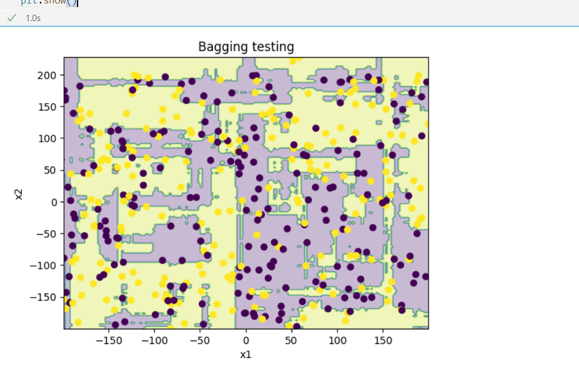
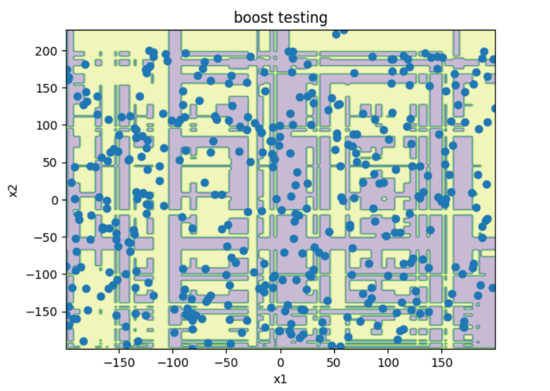
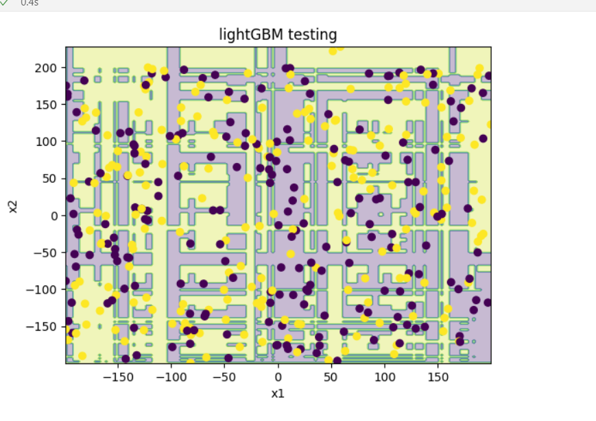
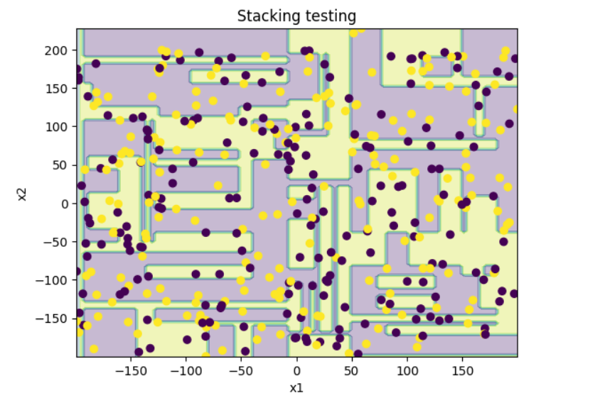
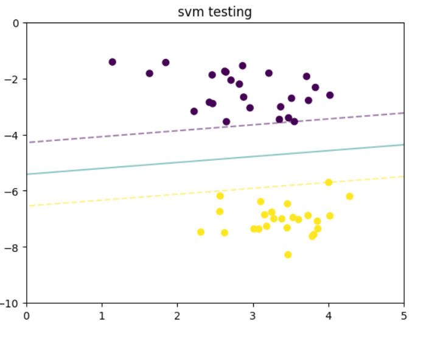

# machine-learning-practice

## Some module testing result

### Linear_Regression:

### Logistic_Regression:

### Kmeans and dbscan:

### Decision_Tree:

### Bagging:

### Boosting:
#### sklearn:

#### lightGBM:

### Stacking:

### SVM:
#### svc-linear

This is a failed model
